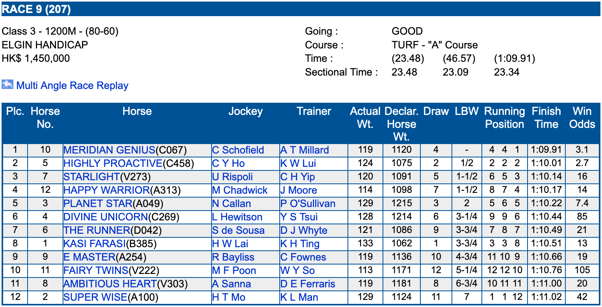
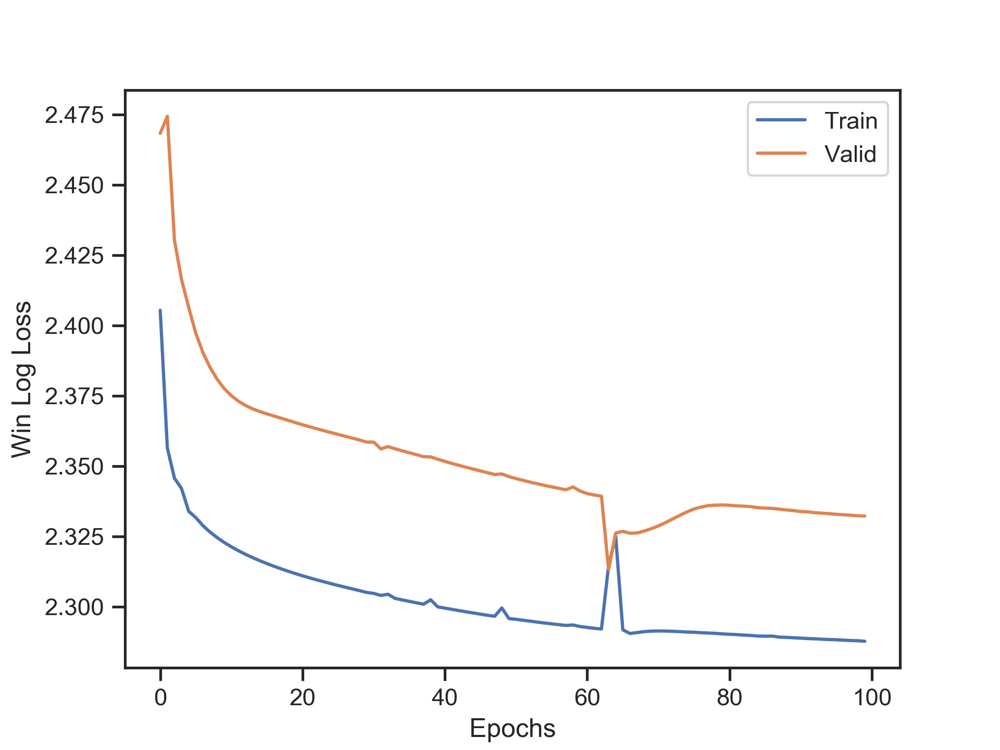
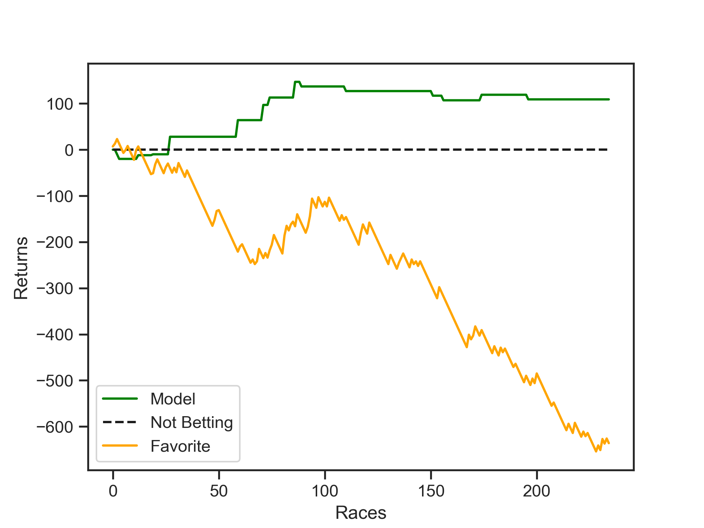

Inspired by the story of [Bill
Benter](https://en.wikipedia.org/wiki/Bill_Benter), a gambler who
developed a computer model that made him close to a billion dollars[^1]
betting on horse races in the Hong Kong Jockey Club (HKJC), I set out to
see if I could use machine learning to identify inefficiencies in horse
racing wagering. <!--more-->

## Data

The Hong Kong Jockey Club publishes all of the results for each race on
their [website](https://racing.hkjc.com/racing/english/index.aspx). I
created a script to scrape result cards from all of the historical
available races. After running the script I was left with a dataset of
938 races spanning 14 months.

 *Result card from a HKJC race.*

## Feature Engineering

Going into this project, I had no industry knowledge about horse racing.
Since not much information is provided with the race result cards, much
work must be done in engineering and selecting features in order to give
a model more predictive power. Listed below are the features being used.

**Draw**: Which gate the horse starts in. This is randomly assigned
before the race. Horses starting closer to the inside of the track (draw
1) generally perform *slightly* better.

**Horse Win Percent**: Horse's win percent over the past 5 races.

**Jockey Win Percent**: Jockey's win percent over the past 5 races.

**Trainer Win Percent**: Trainer's win percent over the past 5 races.

**Actual Weight**: How much weight the horse is carrying (jockey +
equipment).

**Declared Weight**: Weight of the horse.

**Days Since Last Race**: How many days it has been since the horse has
last raced. A horse that had been injured in its last race may have not
raced recently.

**Mean Beyer Speed Figure**: Originally introduced in Andrew Beyer's
*Picking Winners*[^2], the Beyer Speed Figure is system for rating a
horse's performance in a race that is comparable across different
tracks, distances, and going (track conditions). This provides a way to
compare horses that have not raced under the same circumstances. After
reading Beyer's book, I implemented his rating system on my data. For
this feature, I calculated the mean speed figure over the horse's past 5
race the race.

**Last Figure**: Speed figure of the last race the horse was in.

**Best Figure at Distance**: Best speed figure the horse has gotten at
the distance of the current race.

**Best Figure at Going**: Best speed figure the horse has gotten at the
track conditions of the current race.

**Best Figure at Track**: Best speed figure the horse has gotten at the
track of the current race.

Engineering more features may yield better results; Benter's model[^3]
included many different types of features from many data sources.

## Model

Before creating the model, it is important to understand the goal of the
model. In order to not lose money at the race track, one must have an
advantage over the gambling public. To do this we need a way of
producing odds that are more accurate than public odds. For example,
imagine the payout of horse is 5 to 1, and we have a model that
indicates the horse's probability of winning is 0.2, or odds of 4 to 1.
Assuming our model is faithful, we would have an edge in this case, as
we would be getting an expected return of $(0.2 * (5 + 1)) - 1 = 0.2$ or
20%. How do we create such a model?

Let's first assume the existence of a function $R$ that provides a
rating $R_h$ of a horse $h$, given input features $x_h \in \R^m$:

$$ R_h = R(x_h) $$

Assuming a horse with a higher rating has a higher probability of
winning, we can compute the estimated probability of horse $h$ winning,
$\hat{p}_h$, given the ratings of all of the horses in the race:

$$ \hat{p}_h = \frac{\exp(R_h)}{\sum_i \exp(R_i)} $$

Here we use the `softmax` function, as its outputs will always sum to 1,
and maintain the same order as the input.

Now that we know how we'll compute our probabilities, we must define our
rating function $R$. For this we will use a neural network that takes an
input vector of length $m$ (where $m$ is the number of features), and
outputs a single scalar value. The structure of this network consists of
two `Fully Connected` layers, each followed by a `ReLU`,
`Batch Normalization` and `Dropout` layer. Lastly, there is a final
fully connected layer to produce the single output.

Now we can visualize our model:

### Training

We have defined our model, but how do we train it? For each race, let's
call the winning horse $w$. If we had a perfect model, the predicted
probability of $w$ winning should be 1, that is $\hat{p}_w = 1$. We can
encourage the model to approach this value by defining a loss function
I'll call win-log-loss:

$$ L(\hat{p}_w) = -\log(\hat{p}_w) $$

Win-log-loss will approaches 0 as the win-probability of the winner
approaches 1, and approaches $\infty$ as the win-probability of the
winner approaches 0. Now by minimizing win-log-loss via stochastic
gradient descent, we can optimize the predictive ability of our model.

It is important to mention that this method is different than a binary
classification. Since the ratings for each horse in a race are
calculated using a shared rating network and then converted to
probabilities with softmax, we simultaneously reward a high rating from
the winner while penalizing high ratings from the losers. This technique
is similar to a [Siamese Neural
Network](https://en.wikipedia.org/wiki/Siamese_neural_network), which is
often used for facial recognition.

## Betting

Now that we have predicted win probabilities for each horse in the race
we must come up with a method of placing bets on horses. We can compute
our own private odds for each horse using $1/\hat{p} - 1$. Now we
*could* just bet on every horse whose odds exceed our private odds, but
this may lead to betting on horses with a very low chance of winning. To
prevent this, we will only bet on horses whose odds exceed our private
odds, **and** whose odds are less then a certain threshold, which we
will find the optimal value of over on our validation set.

## Results

We split the scraped race data chronologically into a training,
validation, and test set, ensuring there would be no lookahead-bias. We
then fit the horse-rating model to our training set, checking its
generalization to the validation set:

After fitting the model, we find the optimal betting threshold on the
validation set, in this case odds of `4.9`. We can now display our
simulated results of betting 10 dollars on each horse that our model
indicates. To compare, we also show the results of betting 10 dollars
every race on the horse with the best odds, and one of the best
strategies there is, not betting at all.

We can see that always betting on the horse with the best odds is a
sure-fire way to lose all your money. While the model was profitable
over both the training and validation sets, it is hard to say for sure
how reliable it is because of the very low frequency of its betting.

Benter claimed that his era was a "Golden Age" for computer betting
systems, where computer technology had only recently become affordable
and powerful enough to implement such systems. Today, the betting market
has likely become much more efficient with large numbers of computer
handicappers and more detailed information available to the public.
Nevertheless, developing a profitable model, especially with modern
machine learning methods, may be a feasible task.

Thank you for reading! For any questions regarding this post or others,
feel free to reach out on twitter:
[@teddykoker](https://twitter.com/teddykoker).

[^1]: Kit Chellel, *The Gambler Who Cracked the Horse-Racing Code*,
    2018,
    <https://www.bloomberg.com/news/features/2018-05-03/the-gambler-who-cracked-the-horse-racing-code>.

[^2]: Andrew Beyer, *Picking Winners: A Horseplayer's Guide* (Houghton
    Mifflin Harcourt, 1994).

[^3]: William Benter, "Computer Based Horse Race Handicapping and
    Wagering Systems: A Report," in *Efficiency of Racetrack Betting
    Markets* (World Scientific, 2008), 183--98.
