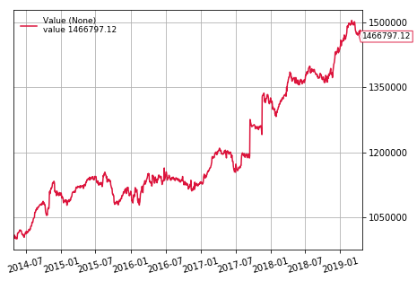

In this post we will look at a cross-sectional mean reversion strategy from Ernest Chan's book [Algorithmic Trading: Winning Strategies and Their Rationale](https://amzn.to/2VptDjd) and backtest its performance using [Backtrader](https://www.backtrader.com/).

Typically, a cross-sectional mean reversion strategy is fed a universe of stocks, where each stock has its own relative returns compared to the mean returns of the universe. A stock with a *positive* relative return is *shorted* while a stock with a *negative* relative return is *bought*, in hopes that a stock that under or outperformed the universe will soon revert to the mean of the universe.

The strategy described in Chan's book is as follows: Everyday, every stock $i$ in the universe is assigned a weight $w_i$ according to the following formula:

$w_i = -(r_i - r_m) / \sum_k | r_k - r_m|$

Where $r_m$ is the mean returns of the universe. This weight will tell us how much of the portfolio will be long or short that particular stock. As we can see in the formula, the farther an individual stock's returns are from the mean, the greater its weight will be.

## Collecting Data

In order to test this strategy, we will need to select a universe of stocks. In this case we will use the S&P 500. So we don't have to re-download the data between backtests, lets download daily data for all the tickers in the S&P 500. We'll start by reading in the list of tickers from [Wikipedia](https://en.wikipedia.org/wiki/List_of_S%26P_500_companies), and save them to a file `spy/tickers.csv`.


```python
import pandas as pd
import pandas_datareader.data as web
import backtrader as bt
import numpy as np
from datetime import datetime

data = pd.read_html('https://en.wikipedia.org/wiki/List_of_S%26P_500_companies')
table = data[0]
tickers = table[1:][0].tolist()
pd.Series(tickers).to_csv("spy/tickers.csv")
```

Now that we have a the list of tickers, we can download all of the data from the past 5 years. We will use `concurrent.futures.ThreadPoolExecutor` to speed up the task.


```python
from concurrent import futures

end = datetime.now()
start = datetime(end.year - 5, end.month , end.day)
bad = []

def download(ticker):
    df = web.DataReader(ticker,'iex', start, end)
    df.to_csv(f"spy/{ticker}.csv")

with futures.ThreadPoolExecutor(50) as executor:
    res = executor.map(download, tickers)

```

Now we should have all our data in the `spy` directory! Now we can get to writing the strategy.

## Strategy

Here is the full strategy using the above formula.


```python
class CrossSectionalMR(bt.Strategy):
    def prenext(self):
        self.next()

    def next(self):
        # only look at data that existed yesterday
        available = list(filter(lambda d: len(d), self.datas))

        rets = np.zeros(len(available))
        for i, d in enumerate(available):
            # calculate individual daily returns
            rets[i] = (d.close[0]- d.close[-1]) / d.close[-1]

        # calculate weights using formula
        market_ret = np.mean(rets)
        weights = -(rets - market_ret)
        weights = weights / np.sum(np.abs(weights))

        for i, d in enumerate(available):
            self.order_target_percent(d, target=weights[i])
```

Note: It is worth mentioning that Backtrader only calls a strategy's `next()` method when it has a price tick from every data feed. This means that by default the strategy will not trade if, for example, a company in the universe has not started trading publicly yet. We can circumvent this issue by calling `next()` in `prenext()` and then applying the weight calculation formula to only stocks in which we have data to.

## Backtesting

We're ready to backtest! Lets see how this strategy works with an initial capital of $1,000,000.


```python
cerebro = bt.Cerebro(stdstats=False)
cerebro.broker.set_coc(True)

for ticker in tickers:
    data = bt.feeds.GenericCSVData(
        fromdate=start,
        todate=end,
        dataname=f"spy/{ticker}.csv",
        dtformat=('%Y-%m-%d'),
        openinterest=-1,
        nullvalue=0.0,
        plot=False
    )
    cerebro.adddata(data)

cerebro.broker.setcash(1_000_000)
cerebro.addobserver(bt.observers.Value)
cerebro.addanalyzer(bt.analyzers.SharpeRatio, riskfreerate=0.0)
cerebro.addanalyzer(bt.analyzers.Returns)
cerebro.addanalyzer(bt.analyzers.DrawDown)
cerebro.addstrategy(CrossSectionalMR)
results = cerebro.run()
```


```python
print(f"Sharpe: {results[0].analyzers.sharperatio.get_analysis()['sharperatio']:.3f}")
print(f"Norm. Annual Return: {results[0].analyzers.returns.get_analysis()['rnorm100']:.2f}%")
print(f"Max Drawdown: {results[0].analyzers.drawdown.get_analysis()['max']['drawdown']:.2f}%")
cerebro.plot()[0][0]
```

    Sharpe: 1.173
    Norm. Annual Return: 7.98%
    Max Drawdown: 6.58%





## Conclusion

As we can see the algorithm did fairly well! It had a Sharpe ratio of 1.17 with a normalized annual return of 7.9%. Although the returns might not be much better then buying and holding SPY, the volatility is greatly reduced. We do, however, have to take a few things into consideration:

1. The dataset we are using may have a slight survivorship bias as it does not contain companies who were in the S&P 500 5 years ago, but have since been removed.

2. The above backtest assumes that it will compute weights at market close then be able to trade at the exact market close price. In reality we wouldn't be able to compute weights with the exact close price, but it would be pretty close.

3. Since this particular algorithm trades every stock in the universe at once, the investor will need a large amount of capital to accurately match the computed weights.

In my next post we will look into some improvements of the strategy, and integrate it with Interactive Brokers Python API so we can start live (paper) trading!
