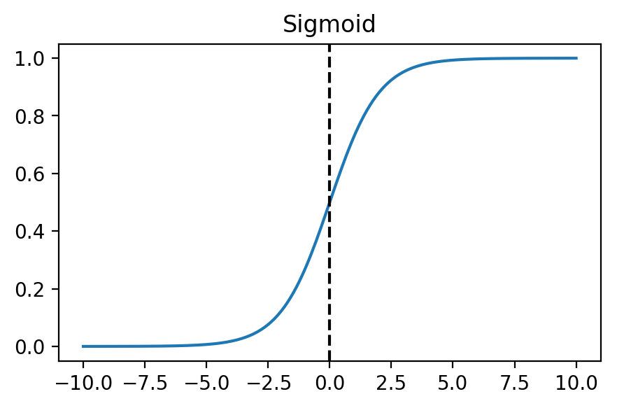
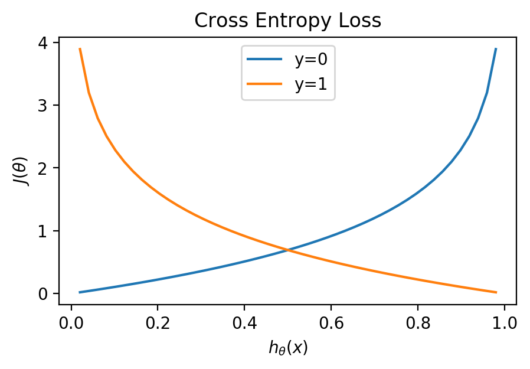
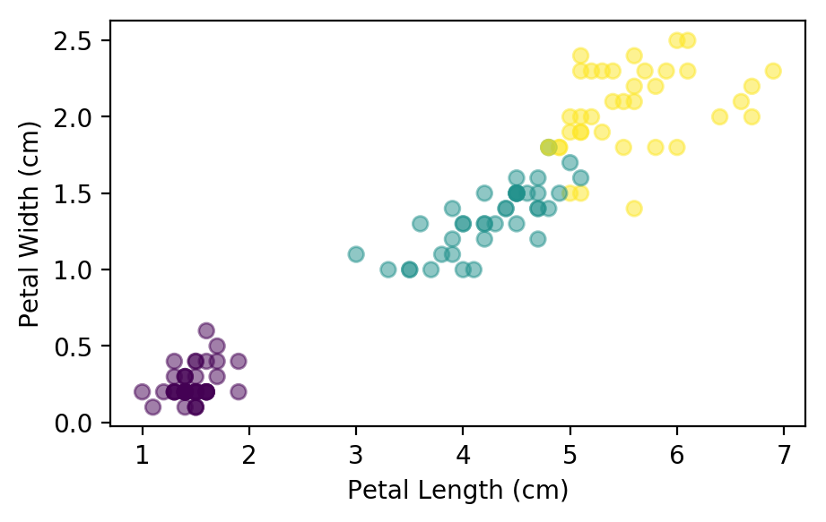
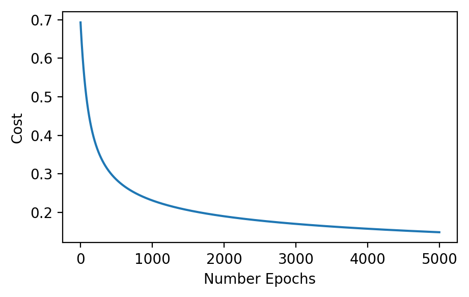
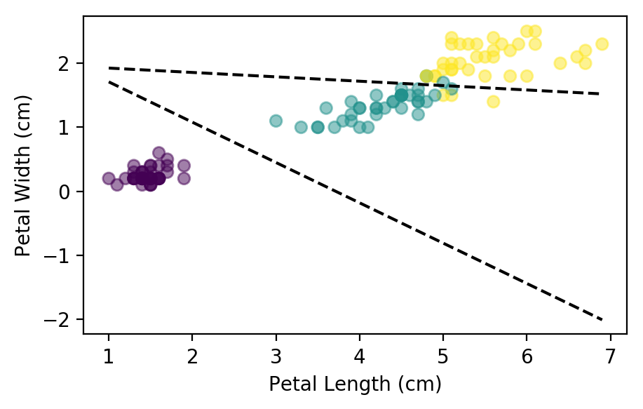

A few posts back I wrote about a common parameter optimization method known as [Gradient Ascent](/2019/05/trading-with-reinforcement-learning-in-python-part-i-gradient-ascent/). In this post we will see how a similar method can be used to create a model that can classify data. This time, instead of using gradient _ascent_ to maximize a reward function, we will use gradient _descent_ to minimize a cost function. Let's start by importing all the libraries we need:

```python
%matplotlib inline
import pandas as pd
import numpy as np
import matplotlib.pyplot as plt
plt.rcParams["figure.figsize"] = (5, 3) # (w, h)
plt.rcParams["figure.dpi"] = 200
np.random.seed(42)
```

## The Sigmoid Function

Let's say we wanted to classify our data into two categories: `negative` and `positive`. Unlike linear regression, where we want to predict a continuous value, we want our classifier to predict the probability that the data is `positive` (1), or `negative` (0). For this we will use the Sigmoid function:

$$g(z) = {1 \over 1 + e^{-z}}$$

This can be represented in Python like so:

```python
def sigmoid(z):
    return 1 / (1 + np.exp(-z))
```

If we plot the function, we will notice that as the input approaches $\infty$, the output approaches 1, and as the input approaches $-\infty$, the output approaches 0.

```python
x = np.linspace(-10, 10, 200)
plt.plot(x, sigmoid(x))
plt.axvline(x=0, color='k', linestyle='--');
plt.title("Sigmoid");
```



By passing the product of our inputs and parameters to the sigmoid function, $g$, we can form a prediction $h$ of the probability of input $x$ being classified as `positive`.

$$h_ \theta(x) = g(\theta^T x)$$

## Cost Function

When we were performing linear regression, we used [Mean Squared Error](https://en.wikipedia.org/wiki/Mean_squared_error) as our cost function. This works well for regression, but for classification we will want to use the Cross Entropy Loss function $J$:

$$J(\theta) = {1 \over m} \sum\limits_ {i=1}^{m} [-y^{(i)} \log h_ \theta (x^{(i)}) - (1 - y^{(i)}) \log (1-h_ \theta (x^{(i)}))]$$

We can understand how the Cross Entropy Loss function works by graphing it. $y$, our classification can be either 1 or zero:

```python
h = np.linspace(0, 1)[1:-1]
for y in [0, 1]:
    plt.plot(h, -y * np.log(h) - (1 - y) * np.log(1 - h), label=f"y={y}")
plt.title("Cross Entropy Loss")
plt.xlabel('$h_ {\\theta}(x)$'); plt.ylabel('$J(\\theta)$')
plt.legend();
```



We can see that a prediction matching the classification will have a cost of 0, but approach infinity as the prediction approaches the wrong classification.

### Gradient Function

Just like last time, we will use the derivative of the cost function with respect to our parameters as the gradient function for our gradient descent:

$${\partial J(\theta)\over \partial\theta} = {1 \over m} \sum\limits_ {i=1}^{m} (h_ \theta (x^{(i)})-y^{(i)})x^{(i)}$$

We can now write single Python function returning both our cost and gradient:

```python
def cost(theta, x, y):
    h = sigmoid(x @ theta)
    m = len(y)
    cost = 1 / m * np.sum(
        -y * np.log(h) - (1 - y) * np.log(1 - h)
    )
    grad = 1 / m * ((y - h) @ x)
    return cost, grad
```

## Training

Just like linear regression with gradient descent, we will initialize our parameters $\theta$ to a vector of zeros, and update the parameters each epoch using: $\theta = \theta + \alpha{\partial J(\theta) \over \partial\theta}$, where $\alpha$ is our learning rate.

One more consideration we have to make before writing our training function is that our current classification method only works with two class labels: `positive` and `negative`. In order to classify more than two labels, we will employ whats known as [one-vs.-rest](https://en.wikipedia.org/wiki/Multiclass_classification#One-vs.-rest) strategy: For each class label we will fit a set of parameters where that class label is `positive` and the rest are `negative`. We can then form a prediction by selecting the max hypothesis $h_ \theta(x)$ for each set of parameters.

With that in mind, let's write our training function `fit`:

```python
def fit(x, y, max_iter=5000, alpha=0.1):
    x = np.insert(x, 0, 1, axis=1)
    thetas = []
    classes = np.unique(y)
    costs = np.zeros(max_iter)

    for c in classes:
        # one vs. rest binary classification
        binary_y = np.where(y == c, 1, 0)

        theta = np.zeros(x.shape[1])
        for epoch in range(max_iter):
            costs[epoch], grad = cost(theta, x, binary_y)
            theta += alpha * grad

        thetas.append(theta)
    return thetas, classes, costs
```

We can also write a `predict` function that predicts a class label using the maximum hypothesis $h_ \theta(x)$:

```python
def predict(classes, thetas, x):
    x = np.insert(x, 0, 1, axis=1)
    preds = [np.argmax(
        [sigmoid(xi @ theta) for theta in thetas]
    ) for xi in x]
    return [classes[p] for p in preds]
```

# Example with Iris Data Set

Now that we have all the code to train our model and predict class labels, let's test it! We will use the [Iris Data Set](https://archive.ics.uci.edu/ml/datasets/iris), a commonly used dataset containing 3 species of iris plants. Each plant in the dataset has 4 attributes: sepal length, sepal width, petal length, and petal width. We will use our logistic regression model to predict flowers' species using just these attributes. First lets load in the data:

```python
url = "https://archive.ics.uci.edu/ml/machine-learning-databases/iris/iris.data"
df = pd.read_csv(url, header=None, names=[
    "Sepal length (cm)",
    "Sepal width (cm)",
    "Petal length (cm)",
    "Petal width (cm)",
    "Species"
])
df.head()
```

<div>
<style scoped>
    .dataframe tbody tr th:only-of-type {
        vertical-align: middle;
    }

    .dataframe tbody tr th {
        vertical-align: top;
    }

    .dataframe thead th {
        text-align: right;
    }

</style>
<table border="1" class="dataframe">
  <thead>
    <tr style="text-align: right;">
      <th></th>
      <th>Sepal length (cm)</th>
      <th>Sepal width (cm)</th>
      <th>Petal length (cm)</th>
      <th>Petal width (cm)</th>
      <th>Species</th>
    </tr>
  </thead>
  <tbody>
    <tr>
      <th>0</th>
      <td>5.1</td>
      <td>3.5</td>
      <td>1.4</td>
      <td>0.2</td>
      <td>Iris-setosa</td>
    </tr>
    <tr>
      <th>1</th>
      <td>4.9</td>
      <td>3.0</td>
      <td>1.4</td>
      <td>0.2</td>
      <td>Iris-setosa</td>
    </tr>
    <tr>
      <th>2</th>
      <td>4.7</td>
      <td>3.2</td>
      <td>1.3</td>
      <td>0.2</td>
      <td>Iris-setosa</td>
    </tr>
    <tr>
      <th>3</th>
      <td>4.6</td>
      <td>3.1</td>
      <td>1.5</td>
      <td>0.2</td>
      <td>Iris-setosa</td>
    </tr>
    <tr>
      <th>4</th>
      <td>5.0</td>
      <td>3.6</td>
      <td>1.4</td>
      <td>0.2</td>
      <td>Iris-setosa</td>
    </tr>
  </tbody>
</table>
</div>

Now well encode the `species` to an integer value, shuffle the data, and split it into training and test data:

```python
df['Species'] = df['Species'].astype('category').cat.codes
data = np.array(df)
np.random.shuffle(data)
num_train = int(.8 * len(data))  # 80/20 train/test split
x_train, y_train = data[:num_train, :-1], data[:num_train, -1]
x_test, y_test = data[num_train:, :-1], data[num_train:, -1]
```

Before we try to create a model using all 4 features, let's start with just the pedal length and width. Lets look at the distribution of the data:

```python
plt.scatter(x_train[:,2], x_train[:, 3], c=y_train, alpha=0.5)
plt.xlabel("Petal Length (cm)"); plt.ylabel("Petal Width (cm)");
```



We can see that there is a clear separation between the first two flower species, but the second pair are a little closer together. Lets see what the model can do with just these two features:

```python
thetas, classes, costs = fit(x_train[:, 2:], y_train)
plt.plot(costs)
plt.xlabel('Number Epochs'); plt.ylabel('Cost');
```



Just like the linear regression, the model improves its cost over each epoch. Let's take a look at the boundaries generated by the parameters:

```python
plt.scatter(x_train[:,2], x_train[:, 3], c=y_train, alpha=0.5)
plt.xlabel("Petal Length (cm)"); plt.ylabel("Petal Width (cm)")
for theta in [thetas[0],thetas[2]]:
    j = np.array([x_train[:, 2].min(), x_train[:, 2].max()])
    k = -(j * theta[1] + theta[0]) / theta[2]
    plt.plot(j, k, color='k', linestyle="--")
```



As we can see, the lines do not separate the flower species perfectly, but they are the best possible fit. Lets see how accurate the model is in the training and test data sets:

```python
def score(classes, theta, x, y):
    return (predict(classes, theta, x) == y).mean()

print(f"Train Accuracy: {score(classes, thetas, x_train[:, 2:], y_train):.3f}")
print(f"Test Accuracy: {score(classes, thetas, x_test[:, 2:], y_test):.3f}")
```

    Train Accuracy: 0.942
    Test Accuracy: 0.933

The model accurately predicts the flower species 94% of the time on the training data set, and performs just a hair worse on the out of sample test set. Let's see if this can be improved by adding all four features:

```python
thetas, classes, costs = fit(x_train, y_train)
print(f"Train Accuracy: {score(classes, thetas, x_train, y_train):.3f}")
print(f"Test Accuracy: {score(classes, thetas, x_test, y_test):.3f}")
```

    Train Accuracy: 0.967
    Test Accuracy: 0.967

This time we get an accuracy of almost 97% for both the training set and out of sample set!

## Conclusion

In this post we learned how we can use a simple logistic regression model to predict species of flowers given four features. This same model can be used to predict whether to buy, sell, or hold a stock using historical indicators as features, which we will look at in our next post.

The Jupyter notebook of this post can be found on my [Github](https://github.com/teddykoker/blog/blob/master/notebooks/multi-class-classification-with-logistic-regression-in-python.ipynb).
