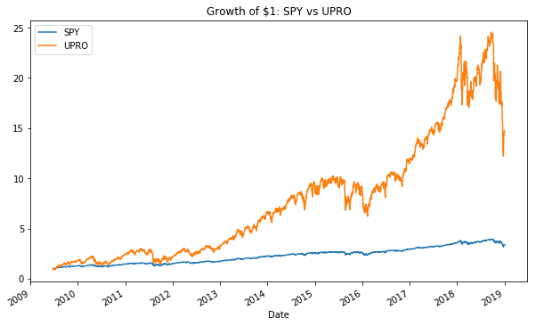
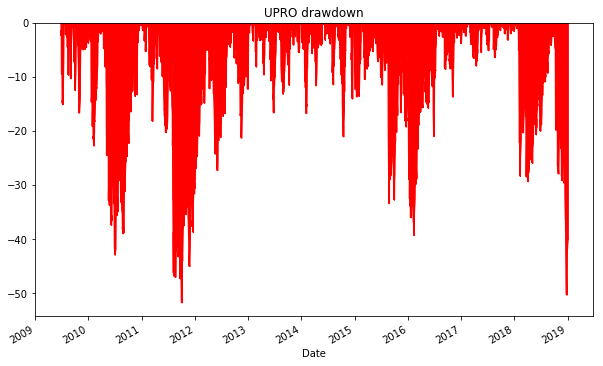
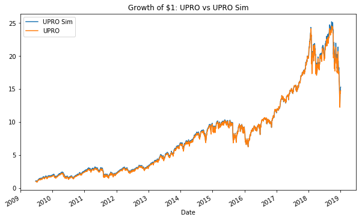
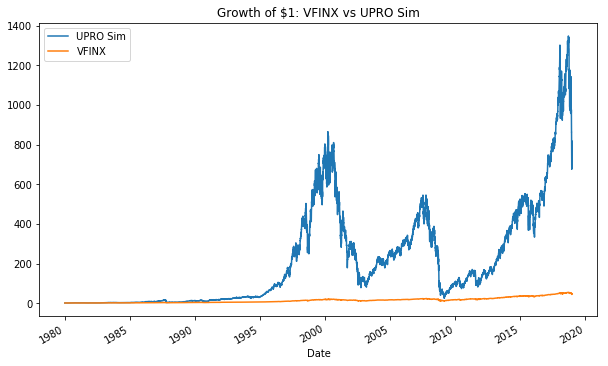
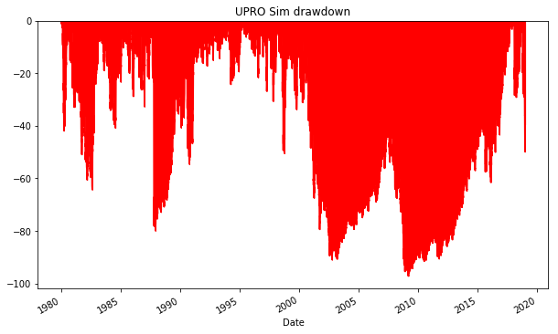

In this post we will look at the long term performance of leveraged ETFs, as well as simulate how they may have performed in time periods before their inception.

Many people would recommend against holding a position in a leveraged ETF because of [beta slippage](https://seekingalpha.com/article/1864191-what-you-need-to-know-about-the-decay-of-leveraged-etfs). Lets take a look at the performance of SPY, an S&P 500 ETF, versus UPRO, a 3x leveraged S&P 500 ETF.

First lets import a few libraries.

```python
import pandas as pd
import pandas_datareader.data as web
import datetime
%matplotlib inline
```

We'll also write a few utility functions to help us out.

```python
def returns(prices):
    """
    Calulates the growth of 1 dollar invested in a stock with given prices
    """
    return (1 + prices.pct_change(1)).cumprod()

def drawdown(prices):
    """
    Calulates the drawdown of a stock with given prices
    """
    rets = returns(prices)
    return (rets.div(rets.cummax()) - 1) * 100

def cagr(prices):
    """
    Calculates the Compound Annual Growth Rate (CAGR) of a stock with given prices
    """
    delta = (prices.index[-1] - prices.index[0]).days / 365.25
    return ((prices[-1] / prices[0]) ** (1 / delta) - 1) * 100
```

Now lets graph the adjusted close of UPRO since its inception versus SPY.

```python
start = datetime.datetime(2009, 6, 23)
end = datetime.datetime(2019, 1, 1)

spy = web.DataReader("SPY", "yahoo", start, end)["Adj Close"]
upro = web.DataReader("UPRO", "yahoo", start, end)["Adj Close"]

spy_returns = returns(spy).rename("SPY")
upro_returns = returns(upro).rename("UPRO")

spy_returns.plot(title="Growth of $1: SPY vs UPRO", legend=True, figsize=(10,6))
upro_returns.plot(legend=True)

print("CAGRs")
print(f"SPY: {cagr(spy):.2f}%")
print(f"UPRO: {cagr(upro):.2f}%")
```

    CAGRs
    SPY: 13.67%
    UPRO: 32.64%



As we can see, the 3x leveraged ETF does out perform its non-leveraged counterpart, but with a trade off of increased risk. Lets look at the drawdowns.

```python
spy_drawdown = drawdown(spy)
upro_drawdown = drawdown(upro)
print("Max Drawdown")
print(f"SPY: {spy_drawdown.idxmin()} {spy_drawdown.min():.2f}%")
print(f"UPRO: {upro_drawdown.idxmin()} {upro_drawdown.min():.2f}%")
upro_drawdown.plot.area(color="red", title="UPRO drawdown", figsize=(10,6));
```

    Max Drawdown
    SPY: 2018-12-24 00:00:00 -19.35%
    UPRO: 2011-10-03 00:00:00 -51.73%



An investor holding SPY during the above time period would have experienced a max drawdown of just under 20%, where an investor long UPRO would have had to endure losing over half their portfolio multiple times!

## Simulating Historical Performance

Up until now we have seen that UPRO does indeed out perform SPY since its inception. However, UPRO has only ever seen a bull market, so it is not surprising that it has had decent annual growth. In order to simulate how UPRO would of done in the past, including the financial crisis, we can apply UPRO's 3x leverage and expense ratio (0.92%) to VFINX, an S&P 500 ETF that has been around since 1976.

Lets write a helper function. Daily percent change is calculated by taking the daily percent change of the proxy, subtracting the daily expense ratio, then multiplying by the leverage.

```python
def sim_leverage(proxy, leverage=1, expense_ratio = 0.0, initial_value=1.0):
    pct_change = proxy.pct_change(1)
    pct_change = (pct_change - expense_ratio / 252) * leverage
    sim = (1 + pct_change).cumprod() * initial_value
    sim[0] = initial_value
    return sim
```

In order to test our simulation, lets compare a simulated UPRO to UPRO since its inception.

```python
vfinx = web.DataReader("VFINX", "yahoo", start, end)["Adj Close"]
upro_sim = sim_leverage(vfinx, leverage=3.0, expense_ratio=0.0092).rename("UPRO Sim")
upro_sim.plot(title="Growth of $1: UPRO vs UPRO Sim", legend=True, figsize=(10,6))
upro_returns.plot(legend=True);
```



The lines are nearly identical! Lets now simulate the hypothetical performance of UPRO since the inception of VFINX.

```python
start = datetime.datetime(1976, 8, 31)
vfinx = web.DataReader("VFINX", "yahoo", start, end)["Adj Close"]
upro_sim = sim_leverage(vfinx, leverage=3.0, expense_ratio=0.0092).rename("UPRO Sim")
upro_sim.plot(title="Growth of $1: VFINX vs UPRO Sim", legend=True, figsize=(10,6))

vfinx_returns = returns(vfinx).rename("VFINX")
vfinx_returns.plot(legend=True)

print("CAGRs")
print(f"VFINX: {cagr(vfinx):.2f}%")
print(f"UPRO Sim: {cagr(upro_sim):.2f}%")
```

    CAGRs
    VFINX: 10.39%
    UPRO Sim: 18.76%



The UPRO Simulation still outperforms its non-leveraged counterpart, but lets look at the drawdowns.

```python
upro_sim_drawdown = drawdown(upro_sim)
vfinx_drawdown = drawdown(vfinx)

print("Max Drawdown")
print(f"VFINX: {vfinx_drawdown.idxmin()} {vfinx_drawdown.min():.2f}%")
print(f"UPRO Sim: {upro_sim_drawdown.idxmin()} {upro_sim_drawdown.min():.2f}%")
upro_sim_drawdown.plot.area(color="red", title="UPRO Sim drawdown", figsize=(10,6));
```

    Max Drawdown
    VFINX: 2009-03-09 00:00:00 -55.25%
    UPRO Sim: 2009-03-09 00:00:00 -97.11%



VFINX does have a fairly substantial drawdown of over 55%, but an investor holding the simulated UPRO would encounter many large drawdowns including one over 97% during the financial crisis in 2008!

## Conclusion

The simulated UPRO had an average compound annual growth rate of 18.76% compared to the 10.39% of the S&P 500. Although the returns are higher, the near 100% drawdowns make it an extremely risky investment to be held on its own. In the [next post](/2019/04/backtesting-portfolios-of-leveraged-etfs-in-python-with-backtrader/) we will explore simulated historical performance of other leveraged ETFs and look at some multi-asset allocation strategies.
